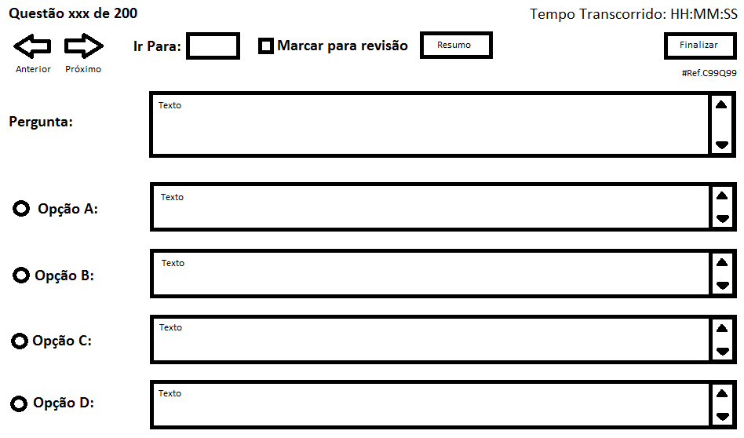
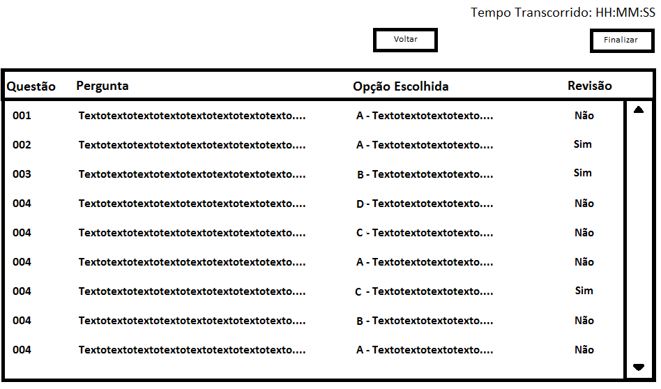
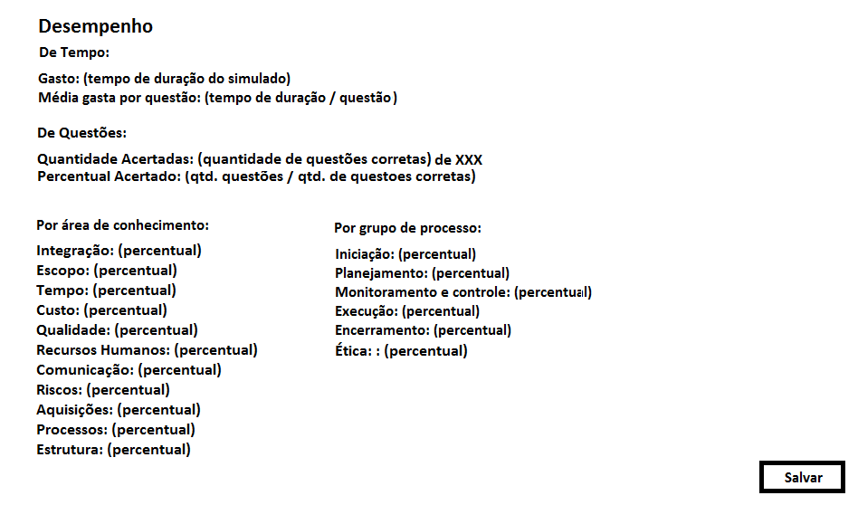
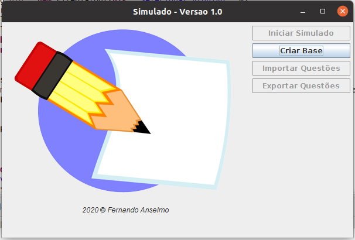
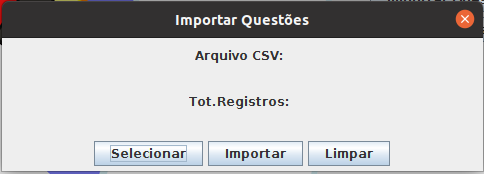

# Realização de Simulados

Documentação do projeto simulado conforme definido e deve ser utilizada para um melhor entendimento e posterior manutenção deste projeto.

## Detalhes Técnicos

Este projeto foi construído com os seguintes requisitos de software:
* Linguagem de Desenvolvimento: Java
* Banco de dados HSQLDB
* Biblioteca iText

## Detalhes de Instalação

Deve estar instalado o Java SE versão 1.8 ou superior.

O programa (simulado.jar) deve ser inserido em uma pasta sem acentos ou espaços em seu nome. Nesta pasta deve conter o banco de questões e uma pasta lib com os 
arquivos “hsqldb.jar” e “itextpdf-X.X.jar”

## Detalhes da Importação
Um arquivo em formato CSV (texto) delimitado por “«” será utilizado para importação. A formação do Arquivo deve ser obrigatoriamente a seguinte:

Primeira Linha deve conter o código (no formato: ProvaXX) e o título da prova:
```
CódigoProva«Título
```

As demais linhas:
```
CódigoProva«CódigoQuestão«Questão«RespA«RespB«RespC«RespD«Certa«Área«Grupo«Aula
```

Sendo:

* CódigoProva: Código da Prova (no formato: ProvaXX) dessa questão
* CódigoQuestão: Código da Questão para simples verificação
* Questão: Pergunta
* RespA: Opção 1
* RespB: Opção 2
* RespC: Opção 3
* RespD: Opção 4
* Certa: Qual a resposta correta (informar a letra)
* Área: Área de Aprendizado dessa pergunta
* Grupo: Grupo de Interesse dessa pergunta
* Aula: Ao selecionar determinada aula no arquivo de configuração.

Como por exemplo:
```
Prova01«Prova Teste
Prova01«C01Q01«Isto é teste«Sim«Não«Talvez«Depende«A«Conhecimentos Gerais«Teste
Prova01«C01Q02«Isto é outro teste«Sim«Não«Talvez«Depende«C«Conhecimentos Gerais«Teste
```

### Base de Dados

A estrutura do Banco de Dados é a seguinte:
```
Tabela: prova
----------+--------+---------------+--------------------------------
Campo     | Tipo   | Conteúdo      | Descrição 
----------+--------+---------------+--------------------------------
id         Prova99  char(7)         Chave da Prova
pergunta   Texto    varchar(60)     Título da Prova
------------------------------------------------------------------

Tabela: questoes
----------+--------+---------------+--------------------------------
Campo     | Tipo   | Conteúdo      | Descrição 
----------+--------+---------------+--------------------------------
idProva    Prova99  char(7)         Relacionamento com Prova
idquestao  C99Q99   char(6)         Chave da Questão
pergunta   Texto    VARCHAR(20000)  Pergunta
Opção A    Texto    VARCHAR(20000)  Opção A
Opção B    Texto    VARCHAR(20000)  Opção B
Opção C    Texto    VARCHAR(20000)  Opção C
Opção D    Texto    VARCHAR(20000)  Opção D
resposta   C        char(1)         Opção correta (A|B|C|D)
area       Texto    varchar(20)     Área de Conhecimento
grupo      Texto    varchar(20)     Grupo dentro da Área
aula       99       integer         Aula a que se refere a questão
------------------------------------------------------------------
```

### Arquivo de configuração

Deve ser criado um arquivo chamado **opcao.sim** (formato texto) que contém os seguintes valores para o sistema:
* PROVA=Prova99 – Código da prova
* TEMPO=99999999 – Tempo total de prova
* TOTAL_QUESTAO=999 – Número de questões para a prova
* AC=area1;area2;... – Descrição das áreas de conhecimento separadas por “;” (não obrigatório)
* GP=grupo1;grupo2;... – Descrição dos grupos separados por “;” (não obrigatório)
* AULA=99 – Descrição dos grupos separados por “;” (não obrigatório)

# Requisitos de Tela para o Simulado

## Tela Inicial
 

O botão RESUMO é utilizado para o aluno acessar a Tela de Resumo. O botão FINALIZAR é utilizado para o aluno finalizar o simulado a qualquer momento, porém é necessário confirmar esta ação. Após a finalização do simulado a aplicação apresentará a Tela de Desempenho.

É apresentada a pergunta da questão e as opções de resposta “A”, “B”, “C” e “D”. Somente uma opção pode ser marcada por questão. É possível alterar a opção a qualquer momento antes do simulado ser finalizado. 

Quando o texto de um item da questão (pergunta ou opção) for muito grande, será necessário incluir barras de rolagem vertical para ter acesso a todo o conteúdo do texto. A tela possui o informativo do número da questão e o referencial da quantidade de questões presentes no simulado. A tela possui a informação de referência da questão.

## Tela de Resumo
Mostrar ao aluno o resumo do simulado, com os detalhes das questões, o texto truncado da pergunta, na opção escolhida se for o caso, o texto truncado da opção escolhida, do contrário mostrar um espaço no local, e se está marcada para revisão.

 

Ao pressionar o botão VOLTAR, o aluno retorna para a Tela Inicial na mesma questão onde se encontrava. Se o aluno clicar em uma questão da tela, retorna para a Tela Inicial, porém o registro atual passará a ser o registro escolhido, ou seja, os dados na tela são “links” para os registros das questões. A tela possui uma barra de rolagem vertical para mostrar as 200 questões do simulado. As regras do processo de finalização do simulado é similar as regras do processo da Tela Inicial.

## Tela de Desempenho
Esta tela é mostrada ao finalizar o simulado, apresentado o resumo do desempenho do aluno, conforme apresentado na tela (a tela já possui as informações de cálculo). As informações da área de conhecimento e por grupo de processo apresentarão somente os percentuais de acerto, conforme a seguinte fórmula: 
```
(QTD_Questões_Corretas / QTD_Questões_Grupo_Ou_Área) * 100
```
A quantidade de questões do grupo ou da área será obtida somando-se as informações de área de conhecimento e grupo de processo durante a importação do arquivo “questoes.csv” (ou algum outro formato tabulado).

 

Ao pressionar o botão SALVAR será gerado um arquivo com o nome “desempenho.pdf”. Esse arquivo será dividido em 2 (duas) partes:
1. Desempenho: As informações apresentadas na tela de desempenho.
2. Resumo das Questões: Conterá as seguintes informações:
  1. Referência da Questão: conforme a referência apresentada nas regras gerais.
  2. Opção Escolhida pelo Aluno: Pode ser “A”, “B”, “C” ou “D” ou ainda vazia “ “, caso o aluno não tenha respondido.
  3. Resultado: “Correta”, “Incorreta” ou “Não respondida”.

## Simulados Disponíveis

Java Fundamentos - Pasta: arquivosCSV\javaF - Prova01

# Manual do SISTEMA

Necessário ter o Java - mínimo versão JRE 8.0

A pasta do Sistema é formada do seguinte modo:
```
[pastaRaiz] \ --- simulado.jar
              |
              +-- opcao.sim
              |
              +-- \lib +
                       | 
                       +-- hsqldb.jar
                       |
                       +-- itextpdf-5.1.1.jar  
```

Executar o programa com:
```
java -jar simulado.jar
```

Uma vez o programa se ative, é mostrada a seguinte tela:


Pressionar o botão "Criar Base" para gerar os arquivos do Banco HSQLDB, uma vez realizada esta operação com sucesso, é mostrada a seguinte tela:


Baixar o arquivo de questões disponíveis (formato CSV) e pressionar o botão "Importar Questões":


Nesta tela, pressionar o botão "Selecionar" e localizar o arquivo CSV e pressionar o botão "Importar". Qualquer problema que ocorra, utilizar o botão "Limpar" para remover as questões dessa prova e repetir a operação de Importação. 

Se for realizado com sucesso, na tela principal as opções "Iniciar Simulado" e "Exportação" estarão habilitadas para realização do seu simulado conforme as opções do arquivo "opcao.sim".

Boa Sorte na prova!

## Software ainda em Desenvolvimento:

**Versão 1.0:**

* Criação do Arquivo.
* Funções de Importação e Exportação.
* É possível realizar uma prova porém a tela de resultados apresenta problemas.   
